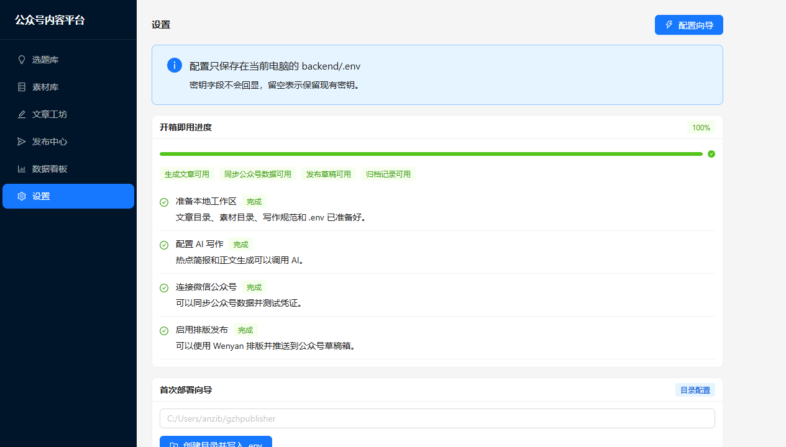
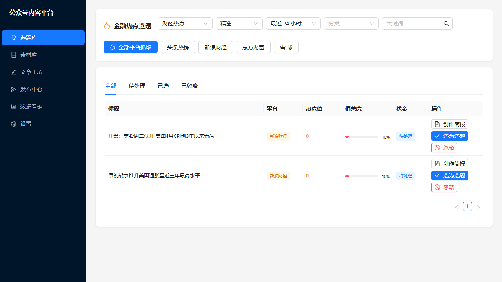
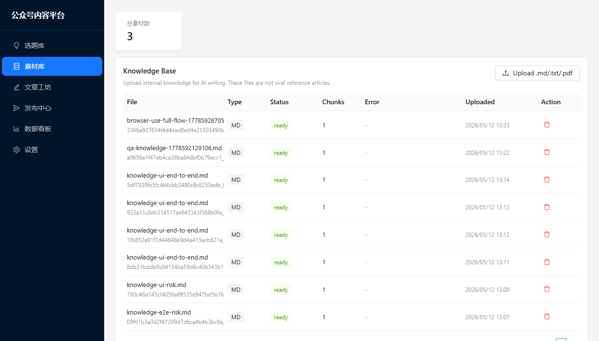
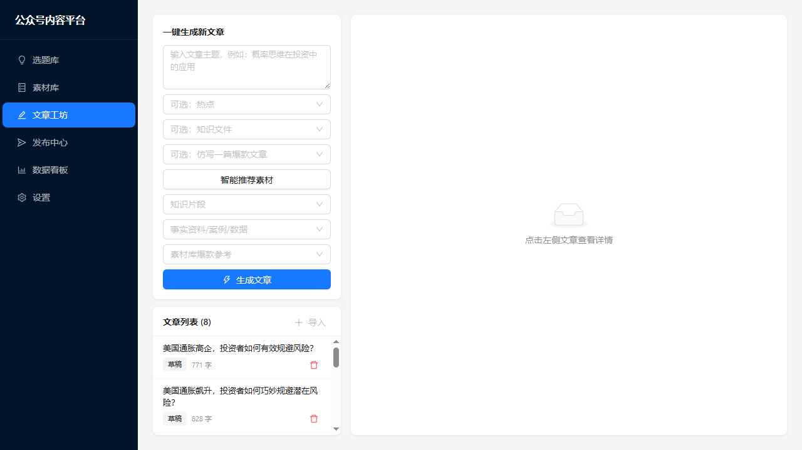
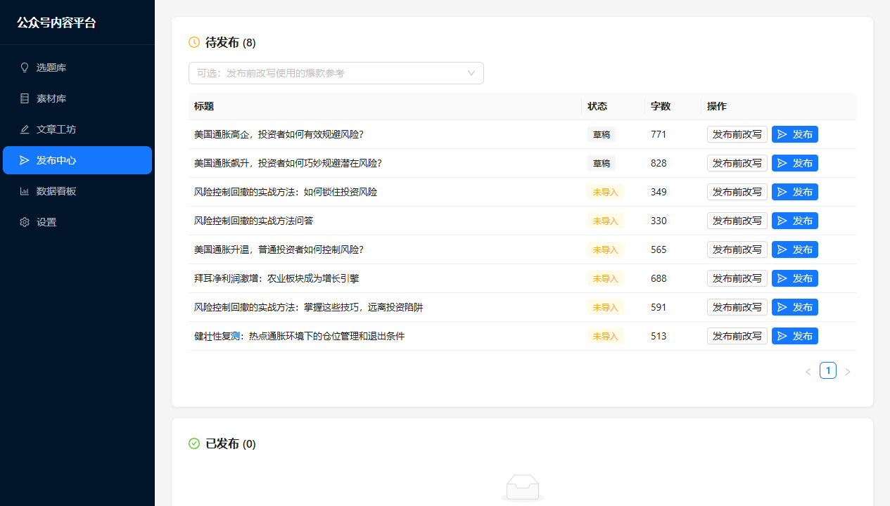
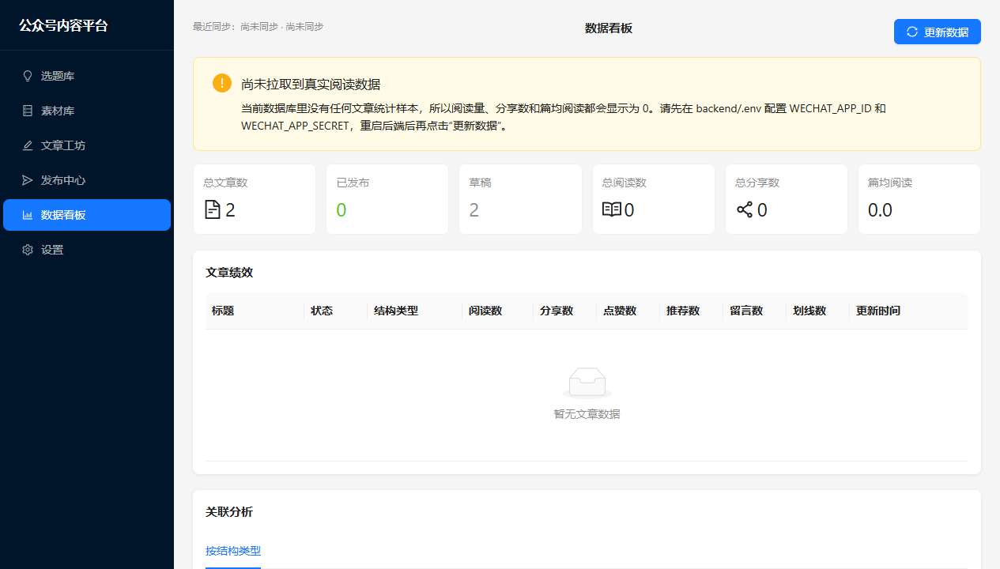
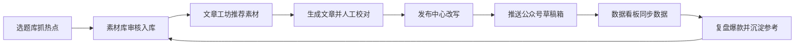

# 公众号内容平台用户使用说明书

本文面向日常使用平台的运营同事，按真实工作顺序说明怎么配置、选题、沉淀素材、生成文章、发布草稿和更新数据看板。

## 1. 打开系统

启动服务后，在浏览器打开：

```text
http://127.0.0.1:3001
```

左侧导航包含 6 个主要模块：

- 选题库：抓取热点、筛选选题、生成素材候选。
- 素材库：审核 AI 自动收集的素材，管理正式素材和知识库。
- 文章工坊：基于主题、热点和素材生成文章。
- 发布中心：发布前改写，并推送到微信公众号草稿箱。
- 数据看板：查看文章阅读、分享、赞、推荐、划线等数据。
- 设置：配置本机目录、AI 模型、微信公众号和环境诊断。

## 2. 首次配置

第一次使用请先进入“设置”页。配置只保存在当前电脑的 `backend/.env`，不会自动同步到 GitHub。



推荐顺序：

1. 点击右上角“配置向导”。
2. 配置本地工作目录，系统会创建文章、素材和资源目录。
3. 填写 AI 写作模型信息，包括 Provider、Base URL、API Key、Model。
4. 填写微信公众号 AppID 和 AppSecret。
5. 到微信公众号后台把当前电脑的公网 IP 加入 IP 白名单。
6. 回到设置页测试 AI 连接和微信公众号连接。
7. 查看“开箱即用进度”，确认需要的能力都已经变绿。

注意事项：

- 密钥输入框留空保存时，会保留原有密钥。
- 换公众号 AppID/AppSecret 后，需要重新测试连接。
- 发布草稿和同步数据都依赖微信公众号后台的 IP 白名单。

## 3. 选题库：抓热点和确定选题

选题库用于从外部来源抓取热点，并把适合写作的内容沉淀为选题。



常用流程：

1. 进入“选题库”。
2. 选择热点来源、时间窗口、分类或关键词。
3. 点击抓取按钮。
4. 查看抓取日志和选题列表。
5. 对有价值的选题继续生成素材候选，或进入文章工坊写作。

判断一个选题是否适合继续推进时，可以重点看：

- 是否和账号定位一致。
- 是否有清晰受众和传播角度。
- 是否能找到可信事实、案例或历史文章作为支撑。
- 是否适合延展成观点型、盘点型、教程型或复盘型文章。

## 4. 素材库：审核素材和管理知识库

素材库负责把临时素材沉淀成正式素材，也可以上传团队自己的知识文件。



素材分为两类：

- 事实资料：适合用来支撑文章观点，例如数据、案例、政策、产品信息。
- 爆款参考：适合用来学习结构、标题、开头、节奏和表达方式。

推荐流程：

1. 查看“AI 自动收集候选”。
2. 判断候选内容是事实资料还是爆款参考。
3. 点击“入库”或“改类入库”。
4. 不可靠、不相关或重复的内容可以忽略。
5. 在 Knowledge Base 区域上传团队自己的 `.md`、`.txt`、`.pdf` 文件。

使用建议：

- 事实资料要优先保留来源链接，方便后续核验。
- 爆款参考不是用来照抄，而是用来辅助 AI 学习结构和风格。
- PDF 上传依赖后端 PDF parser；如果设置页提示缺失，Markdown 和 TXT 仍可正常使用。

## 5. 文章工坊：生成和调整文章

文章工坊用于把主题、热点、知识库和素材组合起来，生成一篇可继续编辑的文章。



推荐流程：

1. 输入文章主题。
2. 可选关联一个热点或选题。
3. 可选指定知识文件范围。
4. 点击“智能推荐素材”。
5. 检查推荐出来的知识片段、事实资料和爆款参考。
6. 点击“生成文章”。
7. 人工检查标题、结构、事实和表达，再保存或进入发布中心。

写作提示可以这样写：

```text
写一篇面向公众号运营人的文章，主题是“如何用数据看板复盘爆款文章”。
风格要实用、清晰、有案例感。可以参考之前阅读量高的文章结构，但不要照搬原文。
```

如果你希望 AI 仿写以前的爆款文章，可以在素材库先把历史爆款文章入库为“爆款参考”，再在文章工坊或发布前改写时明确说明参考目标。

## 6. 发布中心：发布前改写和推送草稿

发布中心用于管理待发布文章，并在发布前生成新的改写版本。



常用流程：

1. 进入“发布中心”。
2. 找到待发布文章。
3. 可选选择爆款参考。
4. 点击“发布前改写”。
5. 检查新生成的发布版草稿。
6. 确认无误后再点击“发布”。

重要提醒：

- “发布前改写”会生成新草稿，不会覆盖原文。
- “发布”会真实写入微信公众号草稿箱，建议由负责人最终确认后再操作。
- 如果发布失败，优先检查微信公众号 AppID/AppSecret、IP 白名单、Node.js 和 Wenyan 依赖。

## 7. 数据看板：更新和复盘文章数据

数据看板用于查看已经发布文章的表现，包括阅读、分享、赞、推荐、划线等指标。



常用流程：

1. 进入“数据看板”。
2. 点击“更新数据”。
3. 查看同步状态、匹配数量和异常提示。
4. 按阅读量降序查看文章表现。
5. 重点关注标记为爆款的文章。

指标说明：

| 指标 | 含义 |
| --- | --- |
| 阅读 | 文章阅读量，是判断传播表现的核心指标 |
| 分享 | 用户主动转发或分享的次数 |
| 赞 | 用户点赞次数 |
| 推荐 | 微信推荐相关指标，具体以公众号后台口径为准 |
| 划线 | 用户划线或类似互动行为 |

爆款判断：

- 阅读量高于 500 的文章会被标记为爆款。
- 复盘爆款时，不只看阅读量，也要结合分享、赞、推荐和划线判断内容是否真正有效。

如果数据没有及时更新：

1. 确认设置页微信公众号连接测试通过。
2. 确认当前公网 IP 已加入微信公众号后台白名单。
3. 点击数据看板里的“更新数据”。
4. 查看同步状态里的错误提示。
5. 如果标题匹配失败，检查本地文章标题是否和公众号后台标题一致。

## 8. 建议的日常工作流



团队协作建议：

- 运营同事负责选题判断、素材审核、文章终审和发布确认。
- 配置负责人维护 AI 模型、微信公众号凭证和 IP 白名单。
- 数据负责人定期更新看板，并把爆款文章沉淀成爆款参考。

## 9. 常见问题

### 页面显示 502 或接口请求失败

通常是后端没有启动。先检查：

```text
http://127.0.0.1:5001/api/health
```

如果打不开，重新启动后端和前端。

### AI 生成失败

检查设置页：

- AI Provider 是否正确。
- Base URL 是否是兼容接口地址。
- API Key 是否有效。
- Model 名称是否正确。
- 账号是否有模型调用额度。

### 微信公众号连接失败

重点检查：

- AppID/AppSecret 是否属于当前公众号。
- 当前公网 IP 是否已经加入白名单。
- 当前公众号是否拥有对应 API 权限。
- 本机网络是否能访问 `api.weixin.qq.com`。

### 数据看板文章缺失

可能原因：

- 本地没有这篇文章记录。
- 公众号后台标题和本地标题差异太大。
- 同步时文章标题匹配失败或被判定为低置信匹配。
- 微信公众号接口没有返回对应时间范围的数据。

处理方式：

1. 在发布中心或文章目录确认本地文章存在。
2. 对照公众号后台标题，尽量保持标题一致。
3. 重新点击“更新数据”。
4. 查看同步结果里的未匹配和异常提示。

### 发布到草稿箱失败

检查：

- 设置页微信公众号连接是否正常。
- Node.js 是否安装。
- Wenyan 发布依赖是否可用。
- 文章内容是否为空或格式异常。

## 10. 安全和发布前检查

正式发布前建议确认：

- 标题、摘要、正文事实已经人工核验。
- 引用数据和外部信息有可靠来源。
- AI 生成内容没有虚构事实。
- 文章没有泄露内部配置、API Key、客户信息或未公开数据。
- 点击“发布”前明确知道这会写入微信公众号草稿箱。

